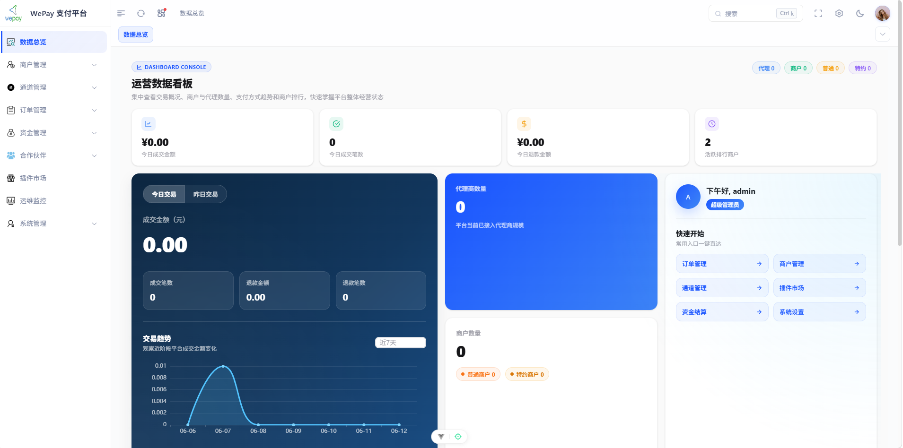
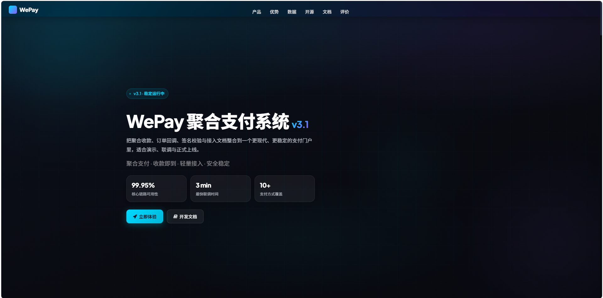
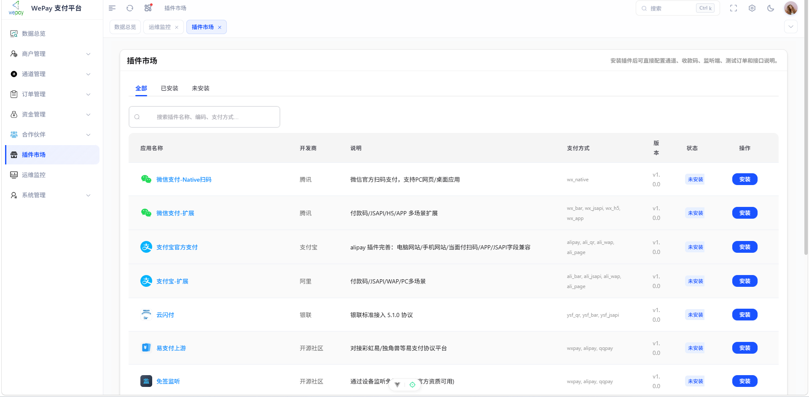
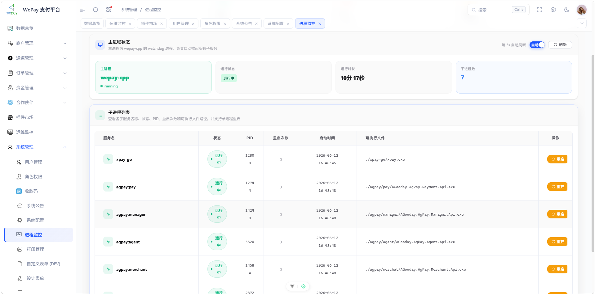
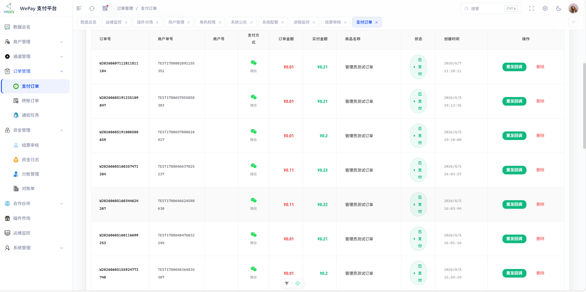
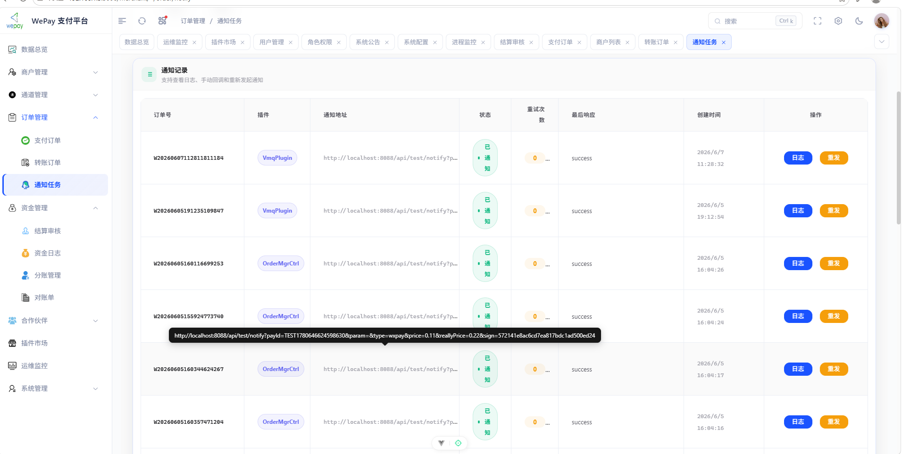

# WePay-Cpp

<div align="center">


**高性能 C++ 支付网关系统**

基于 Drogon 框架的多商户支付聚合平台，支持支付宝、微信支付等多种支付通道

[功能特性](#功能特性) • [快速开始](#快速开始) • [文档](#文档) • [贡献](#贡献)

</div>

---

## 📋 项目简介

WePay-Cpp 是一个用 C++20 开发的高性能支付网关系统，采用现代化的 C++ Web 框架 Drogon 构建。系统支持多商户管理、多支付通道聚合、订单管理、结算管理等完整的支付业务流程。

### 核心优势

- **高性能**: C++20 + Drogon 框架，异步 I/O，高并发处理能力
- **多商户**: 支持多商户入驻，独立费率、独立结算
- **多通道**: 插件化支付通道，支持支付宝、微信支付、QQ钱包等
- **易扩展**: 插件化架构，支持自定义支付通道
- **安全性**: JWT 认证、签名验证、加密存储
- **易部署**: 支持 Docker 部署，一键启动

---

## 📸 界面预览

### 管理后台


### 商户后台


### 支付页面


### 首页


### 更多截图






---

## ✨ 功能特性

### 商户管理
- 多商户入驻与管理
- 商户费率配置
- 商户密钥管理
- 商户状态控制

### 支付通道
- 支付宝 (Alipay)
- 微信支付 (WeChat Pay)
- QQ钱包
- 自建设备 (OCR/安卓监听/挂机)
- 插件化通道扩展

### 订单管理
- 统一下单接口
- 订单查询
- 订单关闭
- 订单补单
- 回调重发

### 结算管理
- 商户结算申请
- 结算审核
- 自动结算
- 结算记录查询

### 资金管理
- 余额查询
- 资金日志
- 手动调账
- 冻结/解冻

### 系统功能
- JWT 认证
- API 签名验证
- 异步回调通知
- 操作日志
- 数据统计

---

## 🛠 技术栈

- **语言**: C++20
- **Web 框架**: [Drogon](https://github.com/drogonframework/drogon)
- **数据库**: SQLite / PostgreSQL
- **缓存**: 内存缓存 / Redis (可选)
- **消息队列**: RabbitMQ (可选)
- **加密**: OpenSSL
- **JSON**: JsonCpp
- **HTTP**: libcurl
- **容器**: Docker / Docker Compose

---

## 🚀 快速开始

### 环境要求

- **编译器**: GCC 9+ / mingw32 / Clang 10+
- **CMake**: 3.15+
- **操作系统**: Windows 10+ / Linux (Ubuntu 20.04+)

### Windows 编译

1. **安装 MSYS2**
```bash
# 下载并安装 MSYS2: https://www.msys2.org/
# 安装 ucrt64 工具链和依赖
pacman -S mingw-w64-ucrt-x86_64-gcc mingw-w64-ucrt-x86_64-cmake
pacman -S mingw-w64-ucrt-x86_64-postgresql mingw-w64-ucrt-x86_64-sqlite3
pacman -S mingw-w64-ucrt-x86_64-openssl mingw-w64-ucrt-x86_64-jsoncpp
pacman -S mingw-w64-ucrt-x86_64-curl mingw-w64-ucrt-x86_64-zlib
```

2. **编译 Drogon**
```bash
# 参考 Drogon 官方文档编译安装
# https://github.com/drogonframework/drogon
```

3. **编译 WePay-Cpp**
```bash
cd h:\wepay
mkdir build && cd build
cmake .. -DCMAKE_BUILD_TYPE=Release
cmake --build . --config Release
```

4. **运行**
```bash
# 首次运行会自动复制 config.json
.\wepay-cpp.exe
```

### Linux 编译

1. **安装依赖**
```bash
sudo apt update
sudo apt install build-essential cmake
sudo apt install libpq-dev libsqlite3-dev
sudo apt install libssl-dev libjsoncpp-dev
sudo apt install libcurl4-openssl-dev libz-dev
```

2. **编译 Drogon**
```bash
# 参考 Drogon 官方文档
git clone https://github.com/drogonframework/drogon
cd drogon
mkdir build && cd build
cmake ..
make -j$(nproc)
sudo make install
```

3. **编译 WePay-Cpp**
```bash
cd wepay-cpp
mkdir build && cd build
cmake .. -DCMAKE_BUILD_TYPE=Release
make -j$(nproc)
```

4. **运行**
```bash
./wepay-cpp
```

### Docker 部署

```bash
# 使用 docker-compose 一键启动
docker-compose up -d

# 查看日志
docker-compose logs -f
```

---

## ⚙️ 配置说明

编辑 `config.json` 配置文件：

```json
{
  "listeners": [
    {
      "address": "0.0.0.0",
      "port": 8088,
      "https": false
    }
  ],
  "sqlite": {
    "path": "wepay.db",
    "encrypt_key": "WePay@2026!Enc#Secure$DB%Key"
  },
  "wepay": {
    "name": "WePay-Cpp",
    "admin_user": "admin",
    "admin_pass": "admin"
  }
}
```

### 主要配置项

- `listeners`: 服务监听配置
- `sqlite`: SQLite 数据库配置
- `pg`: PostgreSQL 数据库配置（可选）
- `jwt`: JWT 密钥配置
- `cors`: 跨域配置
- `rate_limit`: 限流配置
- `cache`: 缓存配置
- `mq`: 消息队列配置（可选）

**⚠️ 生产环境请务必修改默认密码和密钥！**

---

## 📚 文档

- [API 文档](API.md) - 完整的 API 接口文档
- [接入文档](接入文档.md) - 商户接入指南
- [接口实现总结](接口实现总结.md) - 接口实现说明
- [接口对比分析](接口对比分析.md) - 接口对比分析
- [插件 SDK](plugin-sdk/README.md) - 插件开发文档
- [客户端 SDK](sdk/README.md) - 客户端 SDK 文档

### 默认访问地址

- **管理后台**: http://localhost:8088/admin
- **商户后台**: http://localhost:8088/merchant
- **支付网关**: http://localhost:8088/gateway
- **默认账号**: admin / admin

---

## 🔌 插件开发

WePay-Cpp 支持插件化扩展支付通道，详见 [插件开发文档](plugin-sdk/README.md)。

### 支持的插件类型

- 支付通道插件
- 通知插件
- 设备插件

---

## 🐳 Docker 支持

项目提供完整的 Docker 支持：

```bash
# 构建镜像
docker build -t wepay-cpp:latest .

# 运行容器
docker run -d -p 8088:8088 -v $(pwd)/config.json:/app/config.json wepay-cpp:latest

# 使用 docker-compose
docker-compose up -d
```

---

## 📦 项目结构

```
wepay-cpp/
├── src/                 # 源代码
│   ├── main.cc         # 主程序入口
│   ├── common/         # 公共模块
│   ├── admin/          # 管理后台
│   ├── merchant/       # 商户后台
│   ├── gateway/        # 支付网关
│   ├── channel/        # 支付通道
│   └── ...
├── plugin-sdk/         # 插件 SDK
├── sdk/                # 客户端 SDK
├── config.json         # 配置文件
├── CMakeLists.txt      # CMake 构建配置
├── Dockerfile          # Docker 镜像
├── docker-compose.yml  # Docker Compose 配置
├── API.md             # API 文档
└── README.md          # 项目文档
```

---

## 🤝 贡献

欢迎贡献代码！请遵循以下步骤：

1. Fork 本仓库
2. 创建特性分支 (`git checkout -b feature/AmazingFeature`)
3. 提交更改 (`git commit -m 'Add some AmazingFeature'`)
4. 推送到分支 (`git push origin feature/AmazingFeature`)
5. 开启 Pull Request

### 贡献指南

- 遵循现有代码风格
- 添加必要的测试
- 更新相关文档
- 提交前通过编译

---

## 📄 许可证

本项目采用 MIT 许可证 - 详见 [LICENSE](LICENSE) 文件

---

## 🙏 致谢

- [Drogon](https://github.com/drogonframework/drogon) - 优秀的 C++ Web 框架
- [JsonCpp](https://github.com/open-source-parsers/jsoncpp) - JSON 库
- [OpenSSL](https://www.openssl.org/) - 加密库
- 所有贡献者

---

## 📞 联系方式

- **问题反馈**: [GitHub Issues](https://github.com/your-repo/wepay-cpp/issues)
- **技术讨论**: [GitHub Discussions](https://github.com/your-repo/wepay-cpp/discussions)

---

## ⭐ Star History

如果这个项目对你有帮助，请给个 Star 支持一下！

<div align="center">

**Made with ❤️ by WePay-Cpp Team**

</div>
